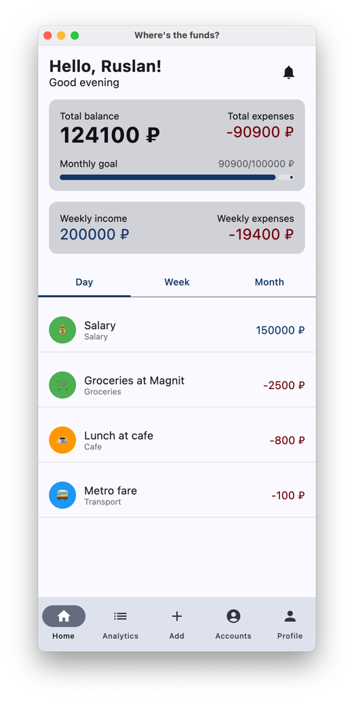
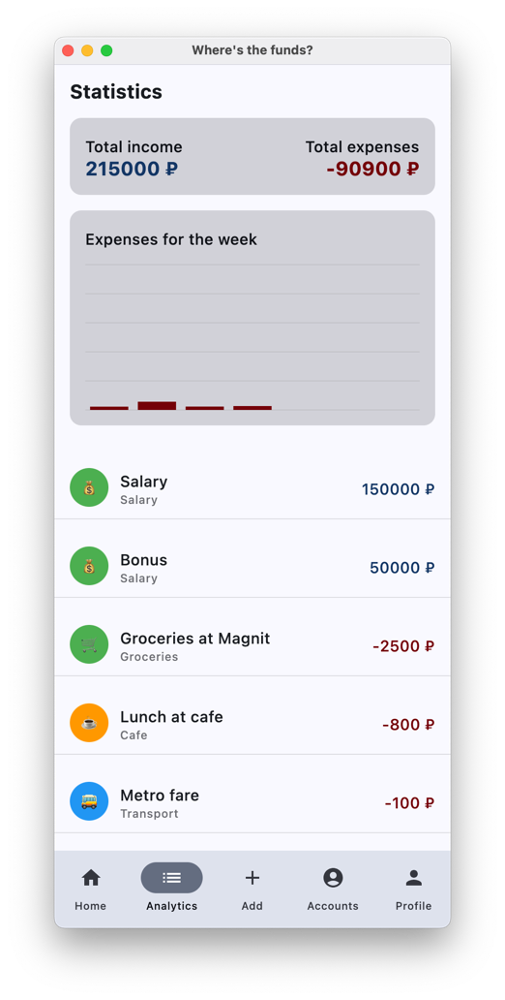
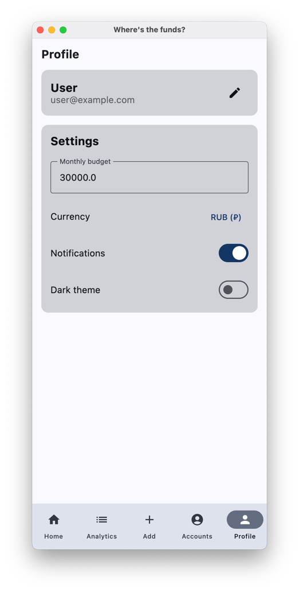

# WTF? (Where are The Funds?)

A modern, minimalist expense tracking application built with Compose Multiplatform. This project serves as an experimental playground to explore the capabilities of Compose Multiplatform for building cross-platform applications.

## About

WTF? (Where are The Funds?) is a personal finance management application that helps you track your expenses and income with a clean, intuitive interface. The project showcases the power of Kotlin and Compose Multiplatform while maintaining a focus on user experience and modern design principles.

## Features

- 💰 Track expenses and income with ease
- 📊 Visual statistics and spending analytics
- 🎯 Monthly budget goals and progress tracking
- 📱 Cross-platform support (iOS, Android & Desktop)
- 🎨 Modern Material Design interface
- 🌙 Multiple categories with emoji support
- 💳 Support for different payment methods
- 📅 Daily, weekly, and monthly transaction views

## Technology Stack

- **Kotlin**: Primary programming language
- **Compose Multiplatform**: UI framework
- **Kotlin Coroutines**: Asynchronous programming
- **Kotlin DateTime**: Date and time handling
- **Material Design**: UI components and styling

## AI Contribution

This project is an interesting experiment in AI-assisted development. A significant portion of the codebase was generated and refined through interactions with various AI models, including:

- Code structure and architecture
- UI components and layouts
- Business logic implementation
- Feature development and refinement

The development process showcases how AI can be leveraged to accelerate development while maintaining code quality and best practices.

## Screenshots

#### Desktop (macOS)

  
  
  
  

#### Android

  
  
  
  

#### iOS

  
  
  
  

## Development Status

This is an experimental project and is currently under active development. Features and UI components may change as the project evolves.

## License

This project is licensed under the MIT License with Commons Clause - see the [LICENSE](LICENSE) file for details.

The Commons Clause condition restricts the commercial use of this software. While you are free to use, modify, and distribute this software, you may not sell it or use it to provide commercial services without explicit permission from the copyright holder.

---

Made with ❤️ and 🤖

